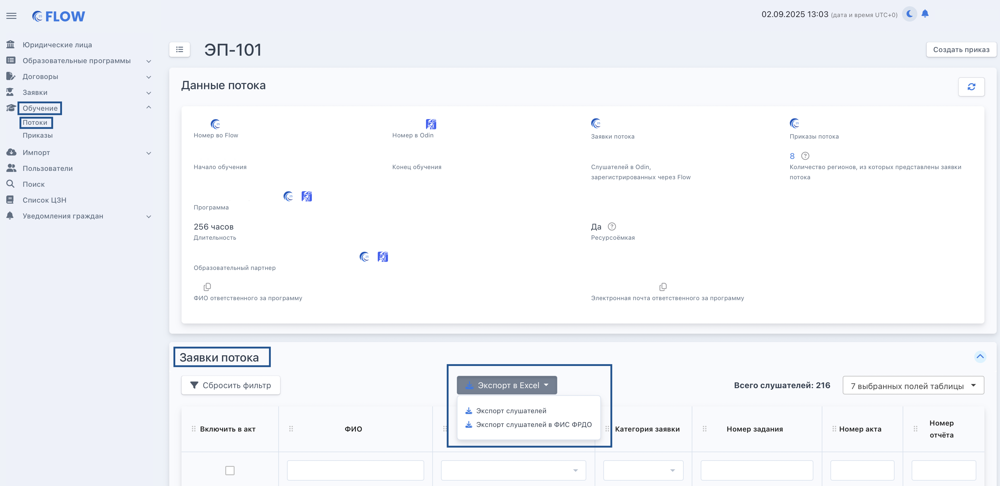

Есть государственная информационная система ФИС ФРДО, в которую каждая образовательная организация отправляет полные данные о полученном человеком образовании

:::info 

**Только если образовательная организация заполнила информацию о лицензии во Flow, то тогда по ее потокам будет доступен экспорт слушателей в ФИС ФРДО.**

:::

Данные эта система принимает в формате Excel-файла. В систему Flow добавлен такой файл-шаблон. В шаблоне есть выпадающие списки с возможными вариантами значений для того, чтобы понимать как правильно автоматически заполнить документ, также при необходимости редактировать в нем данные.

Скачать такой шаблон можно со страницы потока следующим образом: выбрать «Обучение» - «Потоки» - в блоке «Заявки потока» нажать «Экспорт в Excel» - выбрать «Экспорт слушателей в ФИС ФРДО».

{width=3338px height=1624px}

При нажатии на пункт меню “Экспорт слушателей в ФИС ФРДО” скачивается заполненный по шаблону файл с людьми по потоку. В файл включаются только граждане, у которых внесены данные документа о квалификации.

