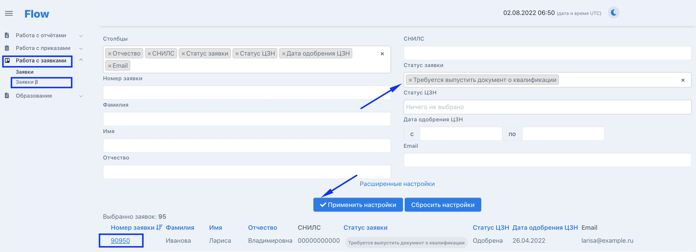

Добавление документа о квалификации во Flow

После успешного [завершения обучения](https://gramax.smile-tech.study/helpOdin/instrukcii-po-rabote/dlya-administratorov/zavershenie-obucheniya-programm-sodeistviya-zanyatosti) гражданину необходимо добавить документ о квалификации.

Важно! У граждан должны быть добавлены во  Flow [приказы об отчислении с основанием "выдача документа о квалификации"](./../README/_index) и[ скан договоров, подписанных с трёх сторон.](./../../zayavki/dogovor-podpisannyi-vsemi-storonami)

Отсортируйте заявки по статусу "Требуется выпустить документ о квалификации" и откройте страницу заявки. (Для ТГУ статус заявки "Требуется загрузить скан документа о квалификации".)

{width=2304px height=836px}

В блоке "Сканы документов" нажмите пункт "Загрузить документ о квалификации" (для документов о квалификации доступен массовый импорт: пункт [Импорт](./massovyi-import) в левом боковом меню).

.png>)

#### Заполните данные документа о квалификации и загрузите его скан

В блоке "Сканы документов" нажмите "Загрузить/Скачать сканы" и выберите "Документ о квалификации". Заполните необходимые поля, добавьте скан документа и сохраните.

.png>)

## Работа с пользовательской задачей по внесению данных документа о квалификации

1\.После внесения данных по документам о квалификации во Flow на главной странице появится информация о задачах по переносу данных на портал Работа России.

.png>)

2\.Сотрудник ОП с доступом на портал РР открывает задачи, выбирает "Назначенные" - "Внесение данных документа о квалификации" и переносит данные из Flow на РР. (через 3 часа после переноса дашборд во Flow обновится и задача пропадёт).

:::danger 

В поле "Номер документа" вносится номер бланка документа о квалификации

В поле "Серия документа" серия бланка документа о квалификации

:::

.png>)