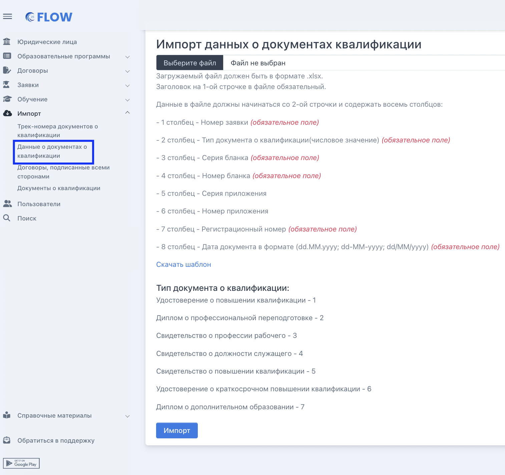
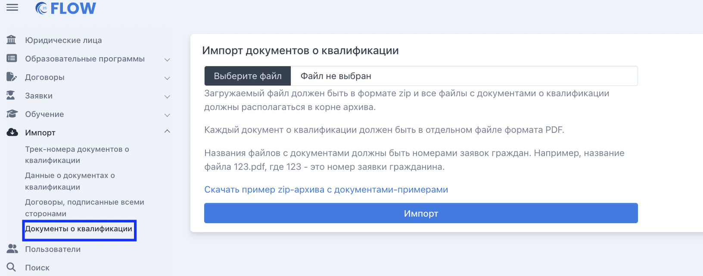

В системе доступен массовый импорт трек-номеров и сканов документов о квалификации.

[tabs]

[tab:Трек-номера документов о квалификации]

Такой импорт доступен в меню "Импорт" - "Трек-номера документов о квалификации". Для импорта необходимо скачать шаблон, заполнить его, после загрузить в систему с компьютера по кнопке "Выбрать файл", затем нажать "Импорт".

{width=993px height=568px}

[/tab]

[tab:Документы о квалификации]

1. Импортируйте данные документов о квалификации. Для импорта необходимо подготовить заполненный по шаблону файл

   {width=1514px height=1424px}

2. Импортируйте сканы документов о квалификации, предварительно подготовив  zip-архив по образцу 

{width=1632px height=642px}

[/tab]

[tab:Договоры, подписанные всеми сторонами]

{width=1728px height=804px}

Импорт доступен из меню "Импорт" - "Договоры, подписанные всеми сторонами". 

[/tab]

[/tabs]