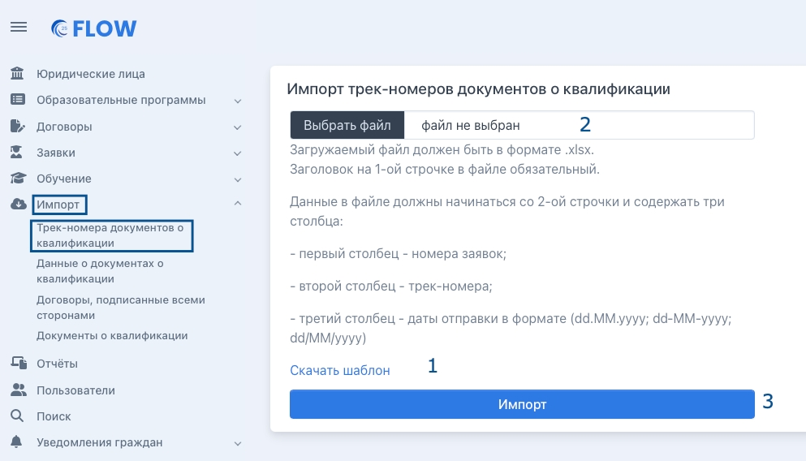
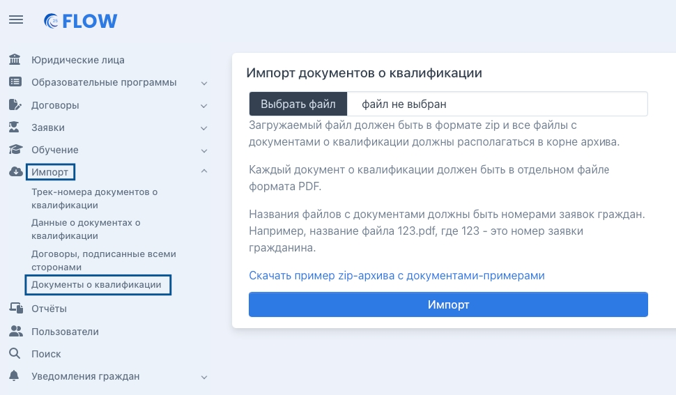

В системе доступен массовый импорт трек-номеров и сканов документов о квалификации.

[tabs]

[tab:Трек-номера документов о квалификации]

Такой импорт доступен в меню "Импорт" - "Трек-номера документов о квалификации". Для импорта необходимо скачать шаблон, заполнить его, после загрузить в систему с компьютера по кнопке "Выбрать файл", затем нажать "Импорт".

{width=993px height=568px}

[/tab]

[tab:Документы о квалификации]

Импорт доступен из меню "Импорт" - "Документы о квалификации". Надо загрузить в систему по кнопке "Выбрать файл" архив в формате Zip. Каждый документ о квалификации должен быть в отдельном файле формата PDF. Названия файлов с документами - это номера заявок граждан. Далее нажать "Импорт".

{width=970px height=567px}

[/tab]

[/tabs]