Публикация программ = появление программы на портале Работа России. У гражданина появляется возможность записаться на программу

Для возможности отправки программы на портал Работа России после её согласования с ФО  необходимо:

-  заключить и подписать [Договор на организацию обучения](./../spravochniki/README/_index),

-  сгенерировать, подписать и согласовать с ФО [Предложение о стоимости](./../spravochniki/predlozhenie-o-stoimosti-dlya-programmy).

:::danger 

Добавление каждого нового потока потребует повторного согласования и публикации программы. [Подробнее](./../potoki-otchyotnye-dokumenty/potok)

:::

## Порядок заведения и согласования образовательных программ:

:::note 

В случае публикации неодобренных программ или программ несогласованных РОИВ региона оплата не предусмотрена.

:::

1. ОП создает программу в Odin. [Подробнее](https://www.odin.study/help/instrukcii-po-rabote/dobavit-programmu-v-ramkakh-proekta-kadry)

2. Программа автоматически появится во Flow в течение 20 минут.

3. ОП дополняет программу параметрами во Flow и отправляет на согласование ФО. [Подробнее](./rabota-s-programmoi)

4. ФО проверяет программу, отмечает регионы, в которых планируется публикация, одобряет программу

5. Программы, которые необходимо опубликовать, отображаются на дашборде - главная страница Flow. (Дашборд обновляется 1 раз в 3 часа.)

6. Сотрудник ОП, который работает на портале РР, заходит на дашборд во Flow и все программы, которые необходимо опубликовать, вручную переносит на РР.

:::danger 

**Важно!**

-  Программа может публиковаться повторно, если она уже есть на РР.

В этом случае необходимо просто найти такую программу и отправить ее на портале Работа России "На модерацию".

-  Программы еще ни разу не было на РР.

В этом случае необходимо сначала ее создать на РР, а потом отправить «На модерацию».

:::

## Образовательные программы в Личном кабинете образовательной организации на портале РР

:::tip 

По всем вопросам/проблемам на портала Работа России необходимо обращаться в техподдержку РР [support_platforma@rostrud.gov.ru](mailto:support_platforma@rostrud.gov.ru)

:::

### Просмотр и фильтрация

Для просмотра образовательных программ необходимо в Личном кабинете образовательной организации перейти в список образовательных программ ("Справочники" – "Образовательные программы").

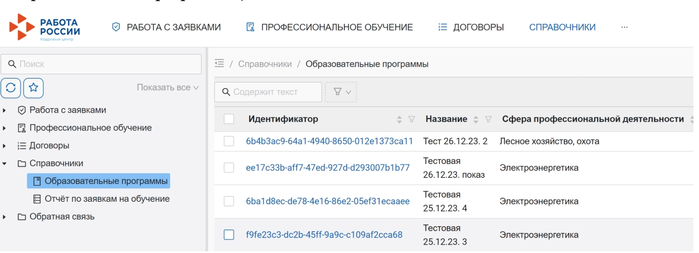{width=1254px height=454px}

В верхней части списка образовательных программ отображается интерфейс, в котором можно задать значения атрибутов для фильтрации списка.

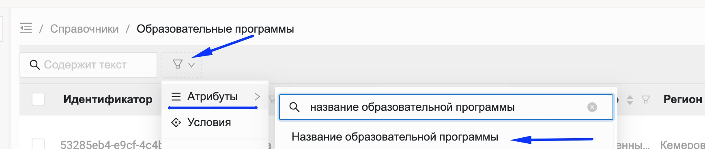{width=1738px height=370px}

Сортировку списка образовательных программ (например, по дате создания) можно осуществлять нажатием на заголовки столбцов в списке.

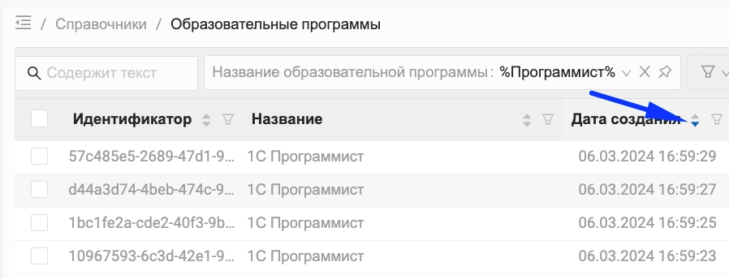{width=898px height=344px}

:::info 

Рекомендуем!

При поиске программы использовать добавляемый атрибут "Название образовательной программы" и команду "Содержит".

:::

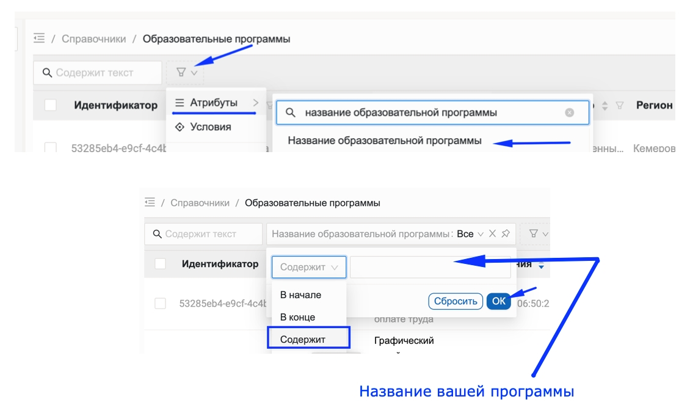{width=1130px height=658px}

В нижней части списка образовательных программ отображается количество записей (с учетом фильтрации) и постраничная навигация всех найденных программ.

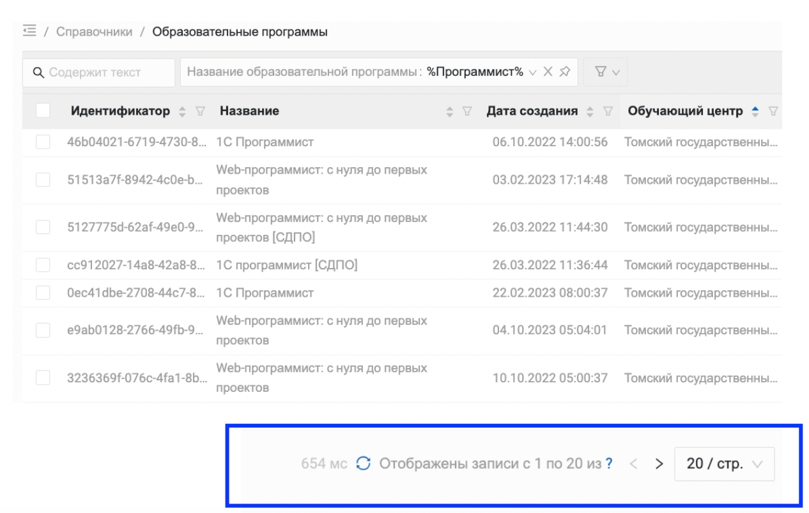{width=1266px height=804px}

Для просмотра карточки образовательной программы с подробной информацией необходимо выбрать её в этом списке и открыть.

### Карточка программы

Карточка образовательной программы состоит из 2-х вкладок:

-  "Данные образовательной программы" – список полей образовательной программы и их значений;

-  "История" – список переходов между статусами образовательной программы с возможностью открытия каждого перехода и просмотра сведений (начальный статус, конечный статус, пользователь-инициатор, для непрошедшей модерацию образовательной программы – причина отклонения).

   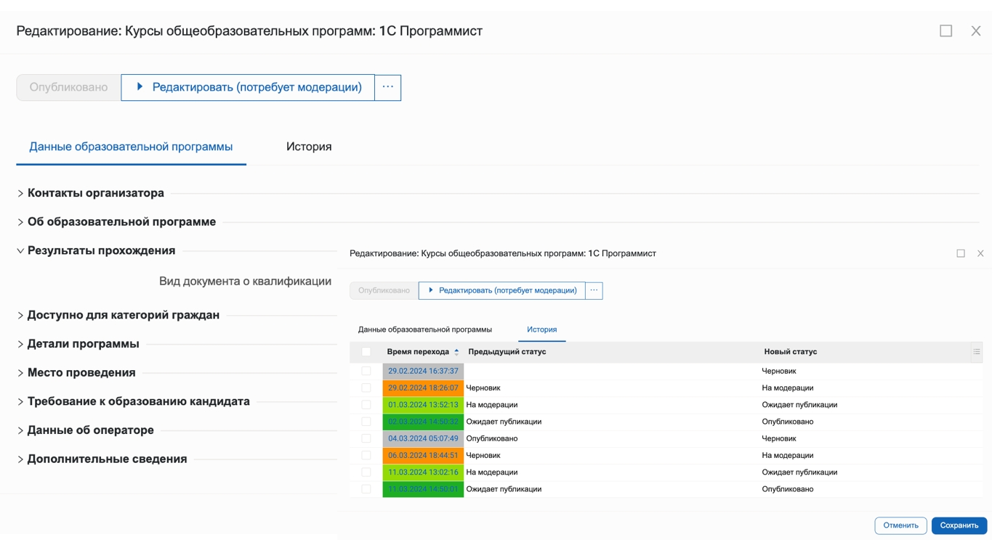{width=1376px height=762px}

## Добавление и публикация

Для добавления новой карточки образовательной программы необходимо на странице со списком образовательных программ выполнить следующие шаги:

## Шаг 1. Нажать кнопку "Добавить"

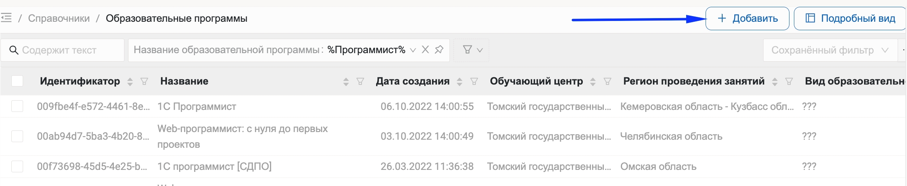{width=2238px height=462px}

## Шаг 2. Заполнить данные

В окне создания новой записи заполнить поля в разделах "Контакты организатора" и "Об образовательной программе". (Обязательные для заполнения поля отмечены звёздочкой)

## Шаг 3. Перенос информации из Flow

1. Открыть карточку программы в статусе "Готова к отправке" во Flow

2. Перейти на вкладку Копировать на РР.

3. Поочередно копировать информацию каждого поля и вставлять в форму создания программы на портале РР

   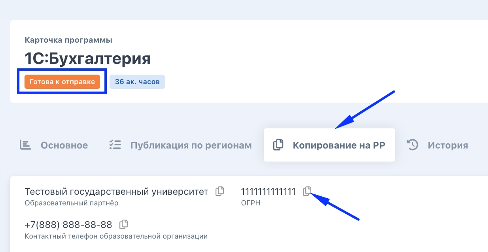{width=1234px height=638px}

:::info 

Некоторые поля в форме будут выбираться из выпадающего списка.

Все поля на вкладке «Копирование на РР» располагаются в том же порядке и имеют такие же названия как на РР.

:::

:::tip 

В строке «Периоды обучения» будут отображаться те потоки, которые удовлетворяют условиям:

-  поток должен стартовать не ранее, чем через 25 дней от текущей даты,

-  поток НЕ архивный,

-  договор на организацию обучения по сроку действия должен покрывать период обучения,

-  должна быть квота в договоре хотя бы на 1 человека,

-  поток должен стартовать не позднее, чем через 3 месяца

:::

### Шаг 4. Перенос Аннотации

В Odin аннотация формируется с определенным форматированием: выделение жирным шрифтом отдельных фраз и т.д.

Это же форматирование следует переносить на портал РР, иначе будет сплошной текст и гражданину при подаче заявки будет сложно его воспринять.

Необходимо:

#### 4\.1 Скопировать кликом мыши на иконку "Копировать" поле "полное описание" на странице программы во Flow.

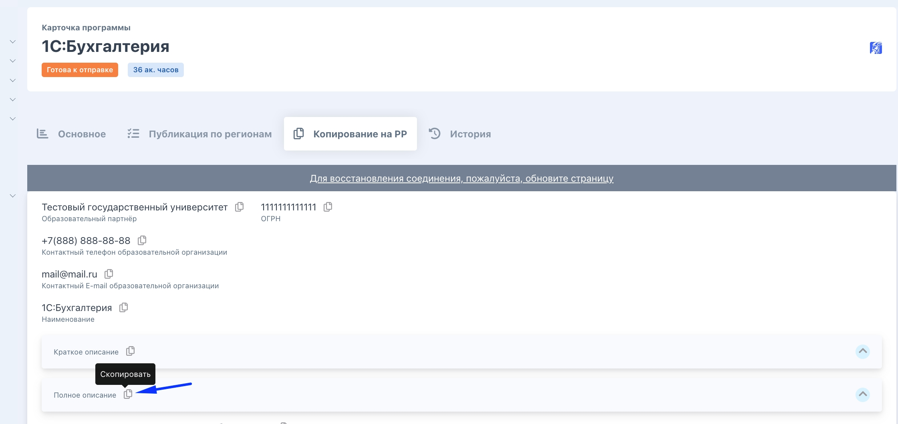{width=2242px height=1062px}

#### 4\.2 Перейти на РР и на странице создания программы в поле «Полное описание» кликнуть на кнопку «Источник»

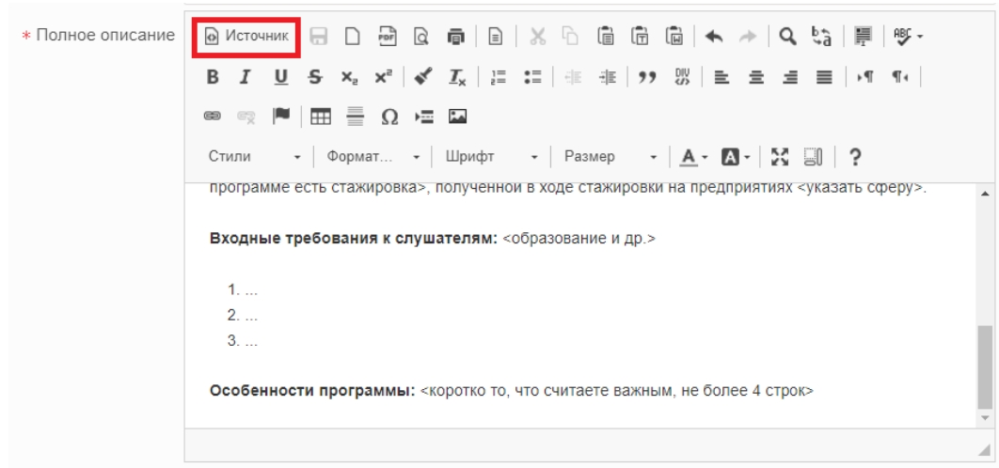{width=1062px height=498px}

[tabs]

[tab:Что будет, если не нажат \"Источник\"?]

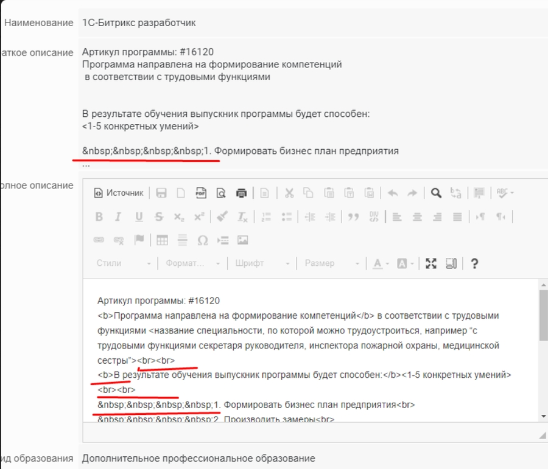{width=900px height=771px}

В аннотации будет масса лишних символов и её придётся редактировать вручную.

[/tab]

[/tabs]

#### 4\.3 Вставить скопированный во Flow текст в поле ввода на РР.

Благодаря тому, что будет нажата кнопка «Источник», вставленный текст будет уже отформатированным и корректным.

#### 4\.4 Отжать кнопку "Источник" в поле "Полное описание» на РР".

Кнопку "Источник" нажать именно **2 раза.**

:::danger 

**Важно!**

В некоторые поля во Flow будет искусственно добавлен "Артикул программы".

**Его удалять нельзя!**

Копировать необходимо на РР c сохранением фразы "Артикул программы", где это предусмотрено.

Артикул **требуется для связывания программы во Flow и на РР.**

"Артикул программы" добавлен в поля:

-  "Примечания к адресу" (поле обязательно должно быть заполнено на РР и будет содержать номер артикула из Flow),

-  "Краткое описание",

-  "Полное описание".

:::

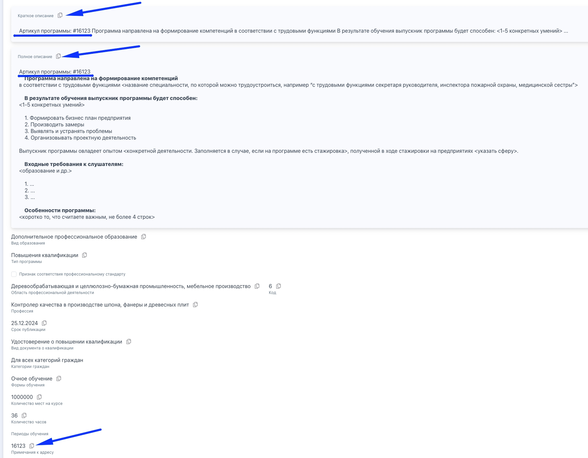{width=1782px height=1388px}

:::info 

**Особенности заполнения некоторых полей (описанные Рострудом):**

-  "Обучающий центр" – в списке доступны образовательные организации, которые указаны для данной учетной записи пользователя;

-  "Срок окончания публикации" – в указанную дату образовательная программа, если она находится в статусе «Опубликовано», будет автоматически переведена в статус "Скрыто";

-  "Периоды обучения" – должен присутствовать хотя бы один период, который начинается через 15 дней от текущего момента, либо позже; подача заявлений на более ранние периоды невозможна;

-  "Партнерское соглашение" – должно быть ранее направлено в систему оператором образовательных центров и может выбираться из сформированного таким образом списка;

-  **"Регион проведения занятий" – образовательная программа создается только для одного региона и будет модерироваться сотрудником службы занятости населения данного региона;**

-  "Стоимость обучения (рублей)" – расчетная стоимость на одного обучающегося по данной образовательной программе; переносится в договор на обучение.

:::

#### 4\.5 Сохранение программы на РР

Нажать на кнопку "Сохранить" – образовательная программа появится в списке.

### Шаг 5. Публикация программы

Перед публикации образовательной программы необходимо:

### 5\.1 Отправить её на модерацию сотруднику СЗН (если это требуется)

Для этого следует открыть карточку образовательной организации и нажать кнопку «На модерацию». (На модерацию программа отправляется в каждом регионе, где согласовано её проведение)

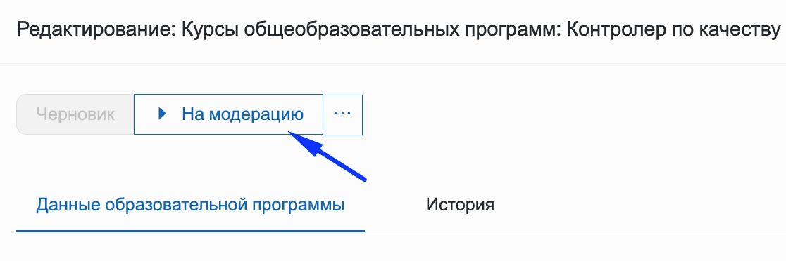{width=1116px height=372px}

### 5\.2 Дождаться проверки

-  В случае **одобрения** образовательной программы сотрудником СЗН она будет переведена в статус «Опубликовано» и при следующей синхронизации с порталом «Работа России» станет доступна для подачи заявлений на обучение (синхронизация происходит 4 раза в сутки).

:::note 

Образовательная программа в статусе "Опубликована" недоступна для редактирования.

:::

-  При наличии у сотрудника СЗН **замечаний** к указанной информации по образовательной программе она переводится в статус «На доработке».

С результатом модерации и причиной отказа в публикации можно ознакомиться в карточке образовательной программы на вкладке «История».

Программу возможно отредактировать и повторно отправить **На модерацию**.

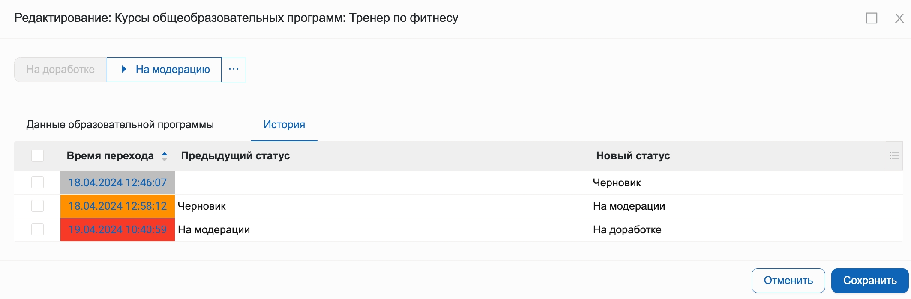{width=2126px height=700px}

:::info 

Если доработка неопубликованной образовательной программы производиться не будет (и обучение по ней не планируется), необходимо перевести её в статус "Архив"

:::

:::danger 

**Обращаем внимание!**

Перенос программы в "Архив" необратим.

**Не получится программу разархивировать и продолжить работу с ней (даже через поддержку РР)!**

При необходимости публикации такой программы необходимо будет заводить новую в Odin и проходить все шаги повторно.

:::

## Шаг 6. Снятие с публикации и редактирование

Сотрудник ОП, кто работает на портале РР, заходит на дашборд на главной странице во Flow. Находит список программ, которые необходимо снять с публикации.

Затем переходит на РР, ищет нужную программу в статусе "Опубликовано" и переводит ее в один из следующих статусов:

-  Скрыто» (кнопка в программе - "Снять с публикации") – образовательная программа перестает отображаться на портале "Работа России" без изменения каких-либо других свойств (в течение 4-х часов)

Используется для временной приостановки публикации. При необходимости ее можно будет перевести обратно в статус «Опубликовано»;

-  Черновик» (кнопка «Редактировать») – образовательная программа перестает отображаться на портале «Работа России» и становится доступной для редактирования.

Используется для изменения атрибутов образовательной программы. При изменении атрибутов образовательной программы требуется последующая модерация сотрудником СЗН.

-  Отправка в архив

Отправка образовательной программы в архив возможна в статусах «Черновик», «На доработке», «Скрыто». **После отправки образовательной программы в архив любые действия с ней будут невозможны.**

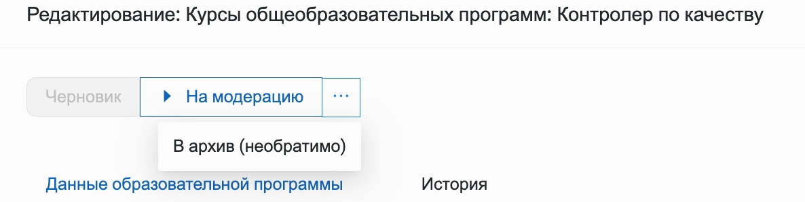{width=1186px height=298px}