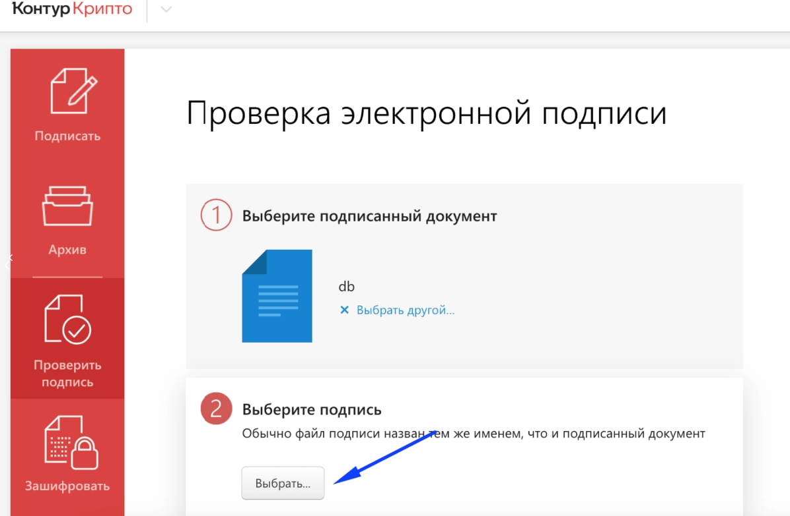
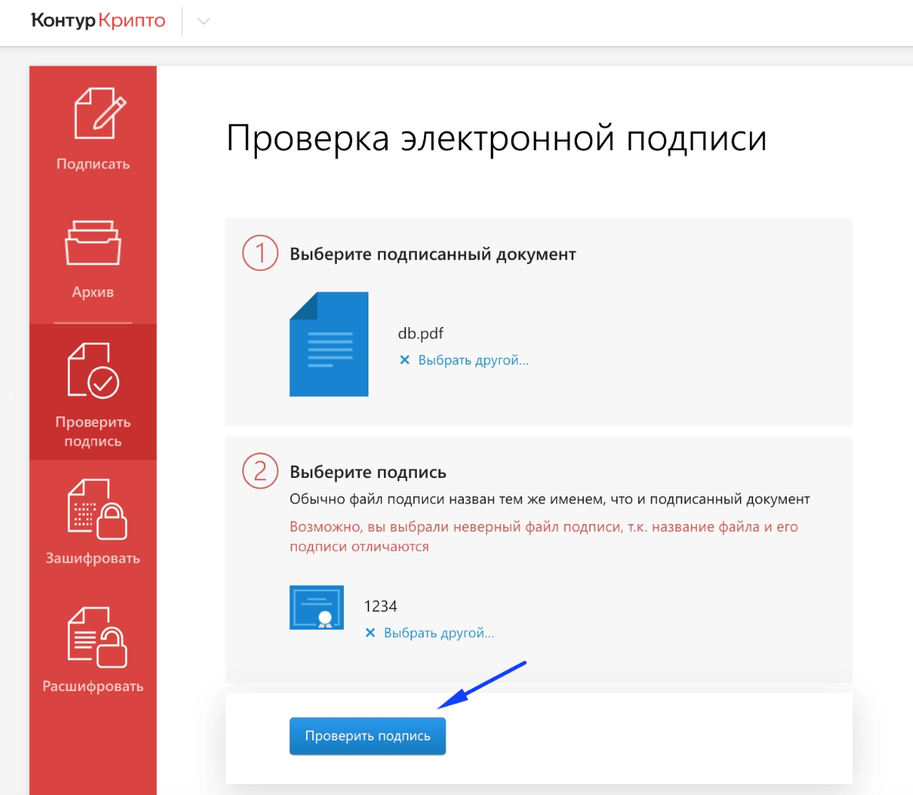
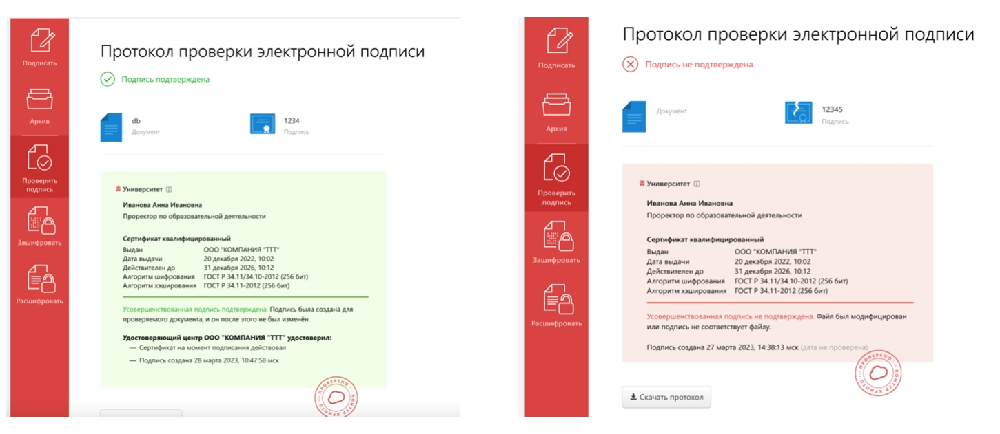
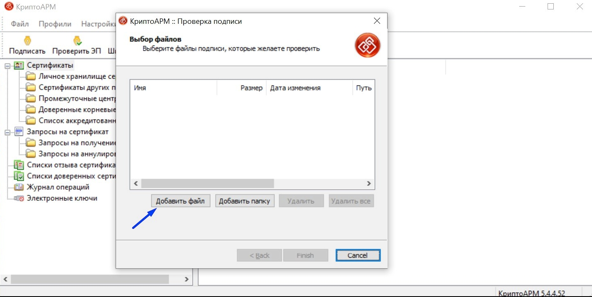
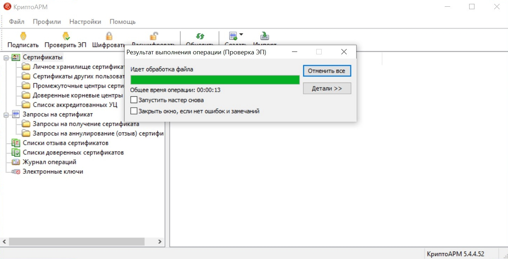

Проверка подписи доступна в том сервисе, где вы проводили подписание документа

Проверить подпись можно в любом сервисе, где вы подписывали документы.

Рассмотрим 2 примера:

[tabs]

[tab:КонтурКрипто]

Проверка подписи в сервисе <https://crypto.kontur.ru/> бесплатна.

1\.Регистрация.

{width=854px height=1261px}

2\.Начать использовать

{width=1655px height=774px}

3\.Далее следует выбрать пункт "Проверка подписи" и загрузить файл в формате pdf.

{width=1196px height=783px}

4\.Далее выбрать файл с sig подписью этого документа

{width=1179px height=798px}

5\.Нажать "Проверить подпись"

{width=1187px height=1033px}

6\.В результате будет один из двух вариантов

{width=1451px height=631px}

В первом варианте всё хорошо, во втором следует переподписать документ. То есть, скачать бланк и, **ничего в нем не меняя (не переименовывать бланк, не пересохранять его тем же названием)**, подписать ещё раз.

[/tab]

[tab:КриптоАРМ]

1\.Откройте Крипто АРМ и выберите пункт "Проверить ЭП".

{width=1438px height=729px}

2\.Выберите sig файл подписанного документа и нажмите Finish.

{width=1439px height=724px}

3\.Дождитесь проверки.

{width=1439px height=734px}

4\.Проверьте детали подписи.

{width=1437px height=733px}

[/tab]

[/tabs]

