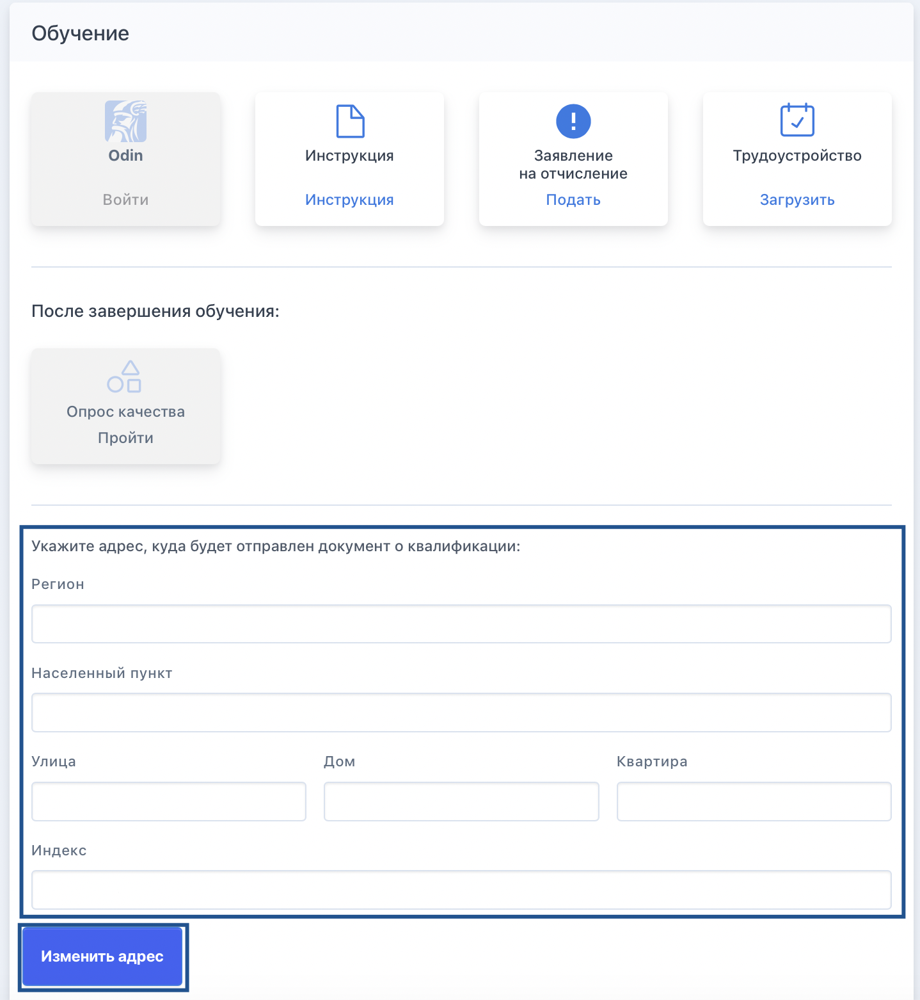

:::info 

Гражданин может самостоятельно в своём личном кабинете заменить адрес доставки до тех пор, пока вы не [запланируете отправку](./kak-zablokirovat-dlya-slushatelya-izmenenie-adres) документа о квалификации. [Подробнее](https://www.flow-crm.study/flowtsuhelpgr/voprosy/kak-smenit-adres-polucheniya-dokumenta-po-zaversh)

:::

Нередко человек переезжает во время обучения и меняет адрес, на который хочет получить документ о квалификации по завершении обучения. Если адрес сменился, гражданин может изменить его самостоятельно в ЛК - либо обратиться к куратору, и тот изменит адрес в заявке. Как это сделать во Flow?

1. Зайти в свой личный кабинет Flow.

2. Перейти в раздел «Обучение» основного меню и в полях блока «Укажите адрес, куда будет отправлен документ о квалификации» изменить адрес на актуальный. Все поля формы обязательны для заполнения.

3. После этого нажать кнопку «Изменить адрес».

{width=1438px height=1562px}