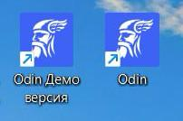
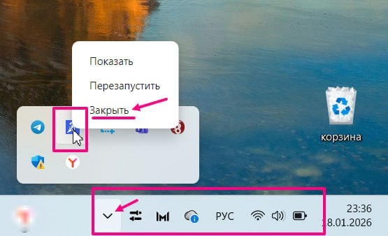

**Демо-версия экзаменационного приложения Odin (или тренажер для сдающих).**

**1\. Скачайте** демо-версию приложения Odin по ссылке (оно работает полностью независимо от реального экзаменационного ПО).

Демо-версия имеет номер 0.0.0 (см. скриншот).

{width=173px height=46px}

**2\.** **Создайте** ярлык на рабочем столе с указанием, что это **демо-версия.** ❗️Не путайте тренажер с основным приложением Odin.(см. скриншот)

{width=202px height=134px}

**3\. Перед запуском** демо-версии убедитесь, что основная версия приложения Odin **закрыта**.

⭐️ВАЖНО! Закрывать приложение следует так: нажмите правой кнопкой мыши на иконку приложения в трее (правый нижний угол экрана компьютера) и нажмите "Закрыть".

{width=555px height=338px}

Если Вы закрываете основное приложение, то убедитесь, что все видео экзаменов уже загружены в систему. Если при нажатии на кнопку "Закрыть" появилось сообщение "Идет загрузка видео". (см. скриншот) Дождитесь загрузки. Иначе загрузка видео остановится.

{width=470px height=151px}

**4\.** **Запустите  демо-версию приложения** (запуск может потребовать около 2-х минут). Выберите уровень для демо-экзамена , нажав на поле "Код для входа",-- и он начнётся автоматически (вариант всегда один и тот же для каждого из уровней)!

**5\.** **Используйте** демо-версию, как тренажер для подготовки сдающих к экзамену.

**6\. Закройте приложение** через трей (как указано в пункте №3 данной инструкции).

Пока демо-версия доступна для Windows, но в планах -- выпустить версию и для Linux.