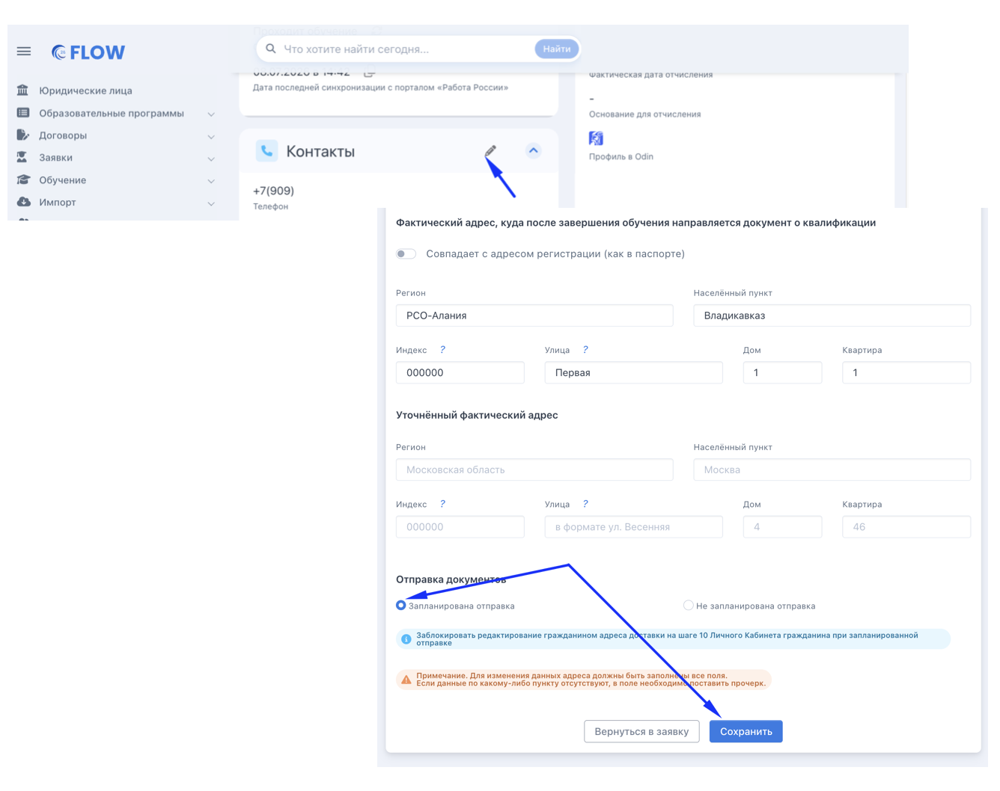

Когда в организации уже подготовлен или готовится к отправке успешно обучившемуся гражданину пакет документов по завершении обучения, сотрудник образовательной организации может закрыть  для гражданина доступ к редактированию адреса для получения документов,  чтобы избежать случаев, когда адрес будет изменён уже после отправки. Для этого во Flow необходимо:

1. Открыть страницу заявки.

2. В блоке «Контакты» нажать на иконку редактирования (карандаш).

3. Отметить пункт «Запланирована отправка» - после этого у гражданина в его ЛК будет заблокирована возможность изменить адрес.

4. Нажать «Сохранить».

{width=1336px height=1058px}