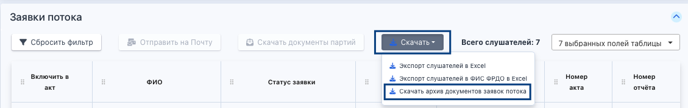

В блоке «Заявки потока» на странице потока есть кнопка «Скачать». Надо нажать на нее и выбрать «Скачать архив документов заявок потока».

{width=1129px height=178px}

Весь архив будет называться по имени потока, из которого происходит выгрузка, а внутри находятся папки, озаглавленные по ФИО заявок. В архив попадают только заявки, у которых есть приказ на зачисление.

Также по этой кнопке «Скачать» можно получить следующие данные:

-  Экспорт слушателей в Excel

-  Экспорт слушателей в ФИС ФРДО в Excel