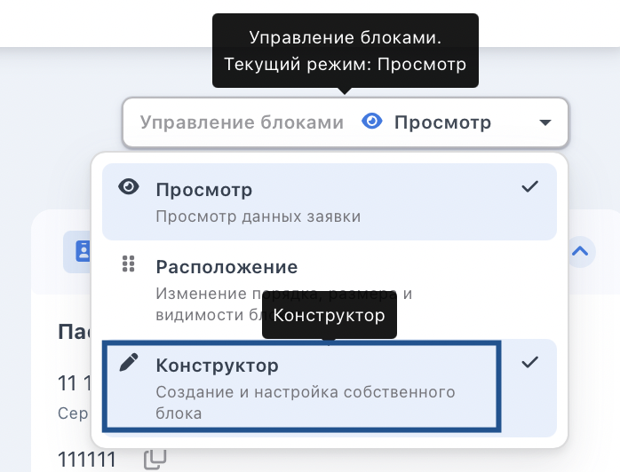
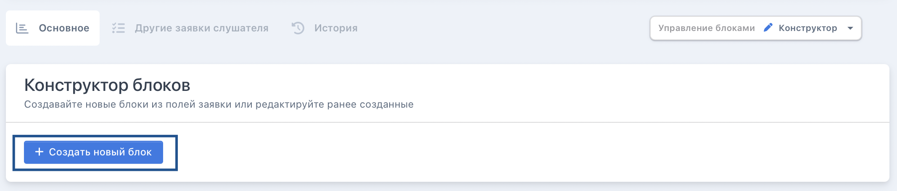
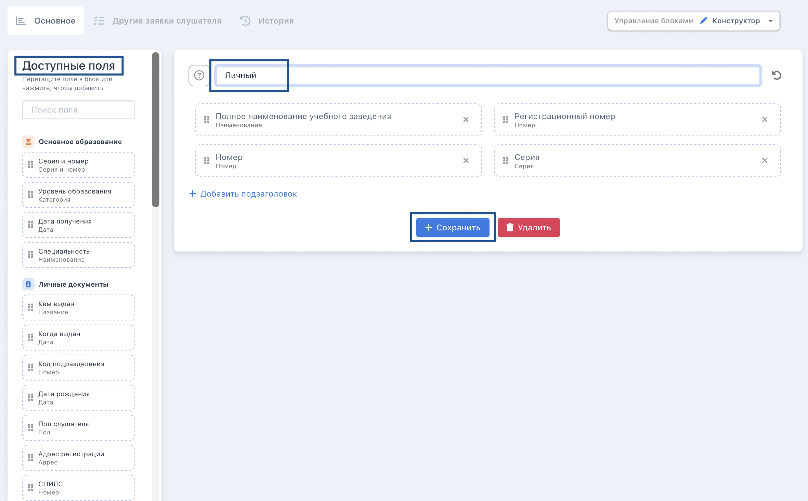
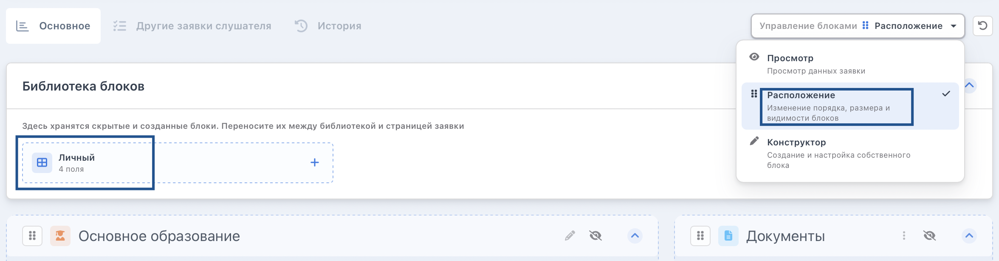

На странице заявки можно добавить блок со свободным назначением. Для этого надо выбрать в меню «Управления блоками» режим «Конструктор».

{width=698px height=532px}

Далее нажать на «Создать новый блок».

{width=2134px height=456px}

Затем заполнить новый блок информацией о названии, наполнить необходимыми полями, расположенными слева, по желанию добавит подзаголовок, сохранить блок. 

{width=2362px height=1468px}

Теперь его можно добавить на страницу заявки через меню управления блоков «Расположение» путем перетаскивания блока на место. 

{width=2352px height=614px}