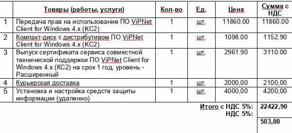
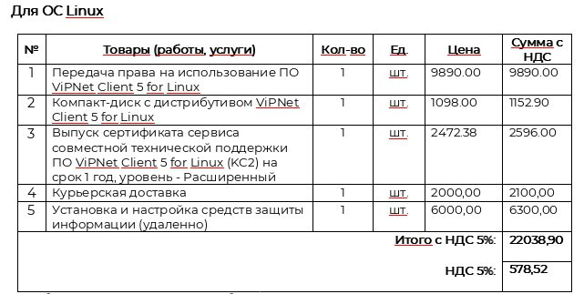

:::note 

Подключение может быть реализовано только в том случае, если Ваша организация прошла квалификационный отбор в ТГУ для участия в проекте «Активные меры содействия занятости».

:::

:::tip 

Если ваша организация уже ранее была подключена к порталу РР по ViPNet через какие-либо сторонние каналы, то делать второе подключение через ТГУ нет необходимости.

Вы можете использовать прежнее работающее подключение.

:::

## Шаг 1

Для работы с защищенной сетью передачи данных (ЗСПД) 15224 необходимо ПО ViPNet Client. Приобретать ПО ViPNet Client для работы в ЗСПД 15224 необходимо у официального поставщика АО "ИнфоТеКС".

**Ближайшего к вам официального поставщика можно найти, перейдя по ссылке** [**https://infotecs.ru/partners/**](https://infotecs.ru/partners/)

Для приобретения необходимо отправить запрос, содержащий сведения о вашей организации (наименование, ИНН), номер защищенной сети 15224 и необходимом количестве ПО ViPNet Client, на электронную почту поставщика.

Одним из проверенных партнёров, кто уже занимался настройкой ViPNet в рамках нашего проекта, является "Маск Сэйф", актуальная почта для заказа info@masksafe.ru.

---

До момента приобретения ПО ViPNetClient вы можете скачать демо-версию:

1. [Для Windows](https://infotecs.ru/downloads/demo/vipnet-client-/)

2. [Для Linux, Android, Aurora](https://infotecs.ru/downloads/demo/vipnet-client-4u/)

Стоимость для ОС Windows

{width=600px height=274px}

Стоимость для ОС Linux

{width=612px height=306px}

*После получения ПО ViPNet Client необходимо получить и установить ключи шифрования для получения доступа к ЗСПД 15224. В случае оплаты услуг по установке ключи передаются и устанавливаются специалистом "Маск Сэйф" при установке ПО. В случае отказа услуг по установке ключи передаются компанией "Маск Сэйф" по электронной почте в виде зашифрованного архива. Пароль от архива можно будет узнать по телефону (3822) 900-110 назвав номер счёта, по которому куплено ПО. В этом случае установку ПО и ключей шифрования организация осуществляет самостоятельно.*

## Шаг 2

На сайте необходимо скачать дистрибутив.

.png>)

## Шаг 3

При "Оформлении заявки" на дистрибутив необходимо ввести данные: Название организации, ФИО, актуальный email на который придет ссылка на скачивание дистрибутива ViPNetClient.

.png>)

## Шаг 4

После "Оформления заявки" на дистрибутив ViPNetClient Вам на почту придет письмо с адреса webmaster@infotecs.ru со ссылкой на дистрибутив ViPNetClient.

Необходимо перейти по ссылке из письма и скачать .zip архив.

## Шаг 5

После завершения скачивания .zip архива, необходимо распаковать .zip архив.

.png>)

## Шаг 6

В распакованном архиве необходимо запустить установку через .exe файл.

.png>)

## Шаг 7

Необходимо нажать на галку "Я принимаю условия лицензионного соглашения" и нажать на кнопку "Установить".

.png>)

## Шаг 8

После установки ViPNet Client программа предложит Вам выполнить перезагрузку. Выполните перезагрузку.

.png>)

## Шаг 9

При загрузке компьютера всплывет окно:

.png>)

Нажимаем кнопку "Да".

## Шаг 10

Далее необходимо выбрать ключи для установки:

.png>)

## Шаг 11

Нажимаем на кнопку "Обзор" и указываем путь до ключей которые были высланы в защищенном архиве полученного от системного администратора по почте. В защищенном архиве располагается файл ключей .dst.

.png>)

Выбираем файл с расширением .dst в качестве файла ключей.

.png>)

Нажимаем на кнопку "Установить".

## Шаг 12

После сообщения "Ключи успешно установлены", нажимаем кнопку закрыть.

.png>)

## Шаг 13

Запустите приложение ViPNet Client:

.png>)

## Шаг 14

Вам откроется окно авторизации пользователя, здесь Вам необходимо ввести пароль который прислал Вам системный администратор в архиве вместе с ключами. Пароль в формате .xps необходимо открыть. Чтобы это сделать рекомендуем воспользоваться [ресурсом](https://products.aspose.app/page/ru/viewer/xps), перейдя по ссылке нажмите на кнопку "поиск файла".

.png>)

В обзоре укажите путь до файла .xps, который был выслан Вам системным администратором.

.png>)

## Шаг 15

Далее необходимо нажать на кнопку "Просмотреть".

.png>)

## Шаг 16

Сайт обработает Ваш пароль и выдаст результат в окне браузера, пожалуйста, запишите свой пароль и сохраните в надежном месте. Пароль будет на англ. языке, внизу на сайте будут слова на русском языке - три первых буквы на английской раскладке в каждом слове есть в пароле. Использовать необходимо пароль только на английской раскладке. В качестве примера! Пароль будет в формате: "яростная дама пьёт солнце" - т.е. в этом случае пароль будет следующим: zhjlfvgm\`cjk.

## Шаг 17

После того как Вы узнали свой пароль вы можете вводить его в окне авторизации (см. пункт 14).

.png>)

## Шаг 18

После всех пунктов в программе ViPNet Client в пункте "Защищенная сеть" должно быть доступно: "Координатор ЦА Роструд" и "Координатор ЦОД Роструд".

.png>)

## Шаг 19

После предыдущих пунктов можно заходить на портал Работа России по [следующему адресу](http://91.107.66.210:8085/app/).

## Шаг 20

Логин и пароль от входа в личный кабинет портала «Работа России» будет предоставлен после создания учетной записи вашей организации на портале.