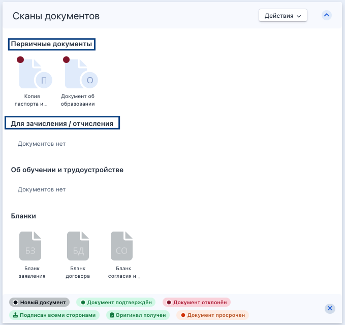
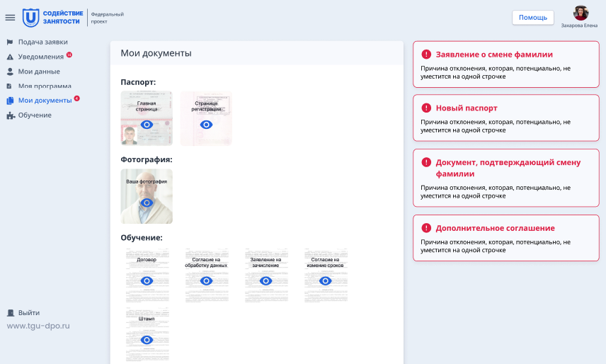
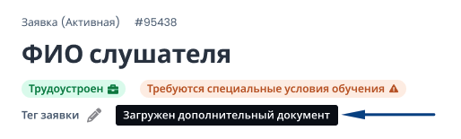
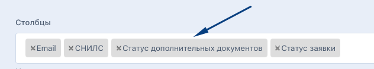

Могут возникнуть потребности в загрузке дополнительных документов, поэтому в системе есть такая возможность, она не влияет на жизненный цикл заявки.

Для этого:

В систему добавлен новый вид документов: дополнительные документы различных типов. Реализованы 4 типа: 

-  заявление о смене фамилии, 

-  новый паспорт, 

-  документ, подтверждающий смену фамилии, 

-  дополнительное соглашение.

В ЛК гражданина загрузка доступна в разделе "Мои документы" в подразделе "Дополнительные документы (по запросу образовательной организации)», который будет отображаться в ЛК только после одобрения ДЗС.

Если гражданин загрузил дополнительный документ и отправил, значит он отобразится на странице заявки в блоке «Сканы документов». Новый паспорт, заявление о смене фамилии и документ, подтверждающий смену фамилии, будут  располагаться в «Первичные документы»; дополнительное соглашение в «Для зачисления/отчисления».

{width=326px height=893px}

Загруженный гражданином дополнительный документ будет отображаться в статусе "Новый". Представитель образовательного партнера или Администратор должен его открыть/проверить и одобрить/отклонить.\
Причина отклонения будет отображаться в ЛК гражданина. При отклонении дополнительных документов, гражданину на почту уходит письмо об отклонении. Гражданин должен заменить документ и заново его отправить.

{width=856px height=514px}

При отправке гражданином дополнительного документа у заявки появится технический тег "Загружен дополнительный документ».

{width=514px height=155px}

В списке заявок есть столбец с фильтром по статусам дополнительного документа: Нет документа, Не проверен, Подтвержден, Отклонен.

{width=632px height=118px}

Все загруженные дополнительные документы гражданина будут попадать в архив с его документами, который скачивается со страницы заявки, и который скачивается в подтверждающих документах к Акту на странице потока.