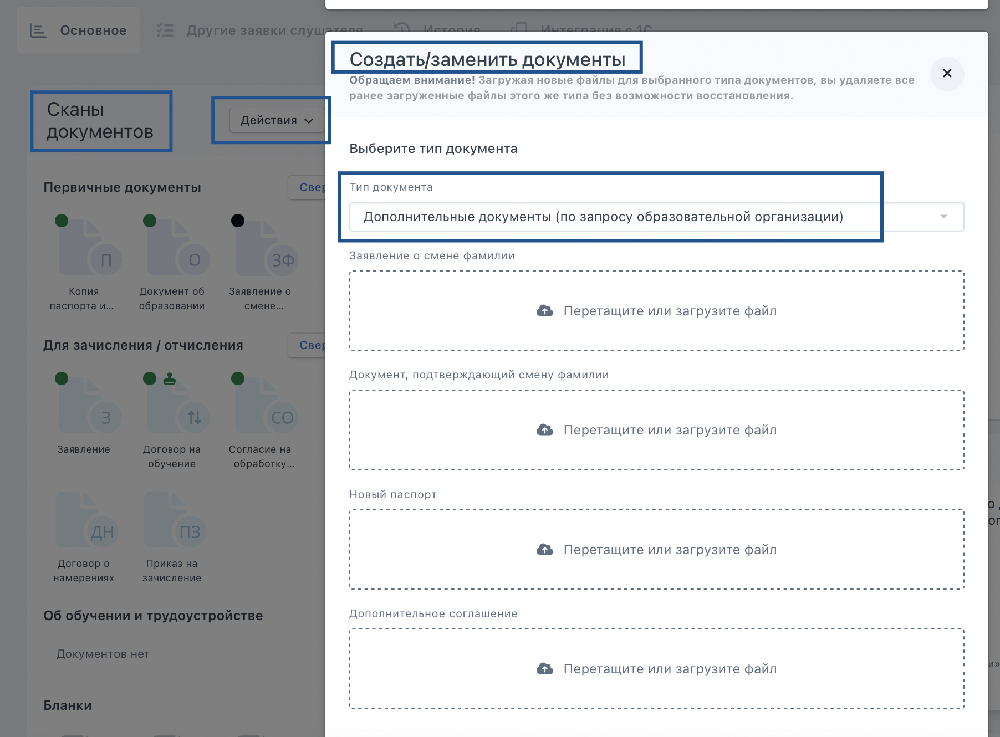
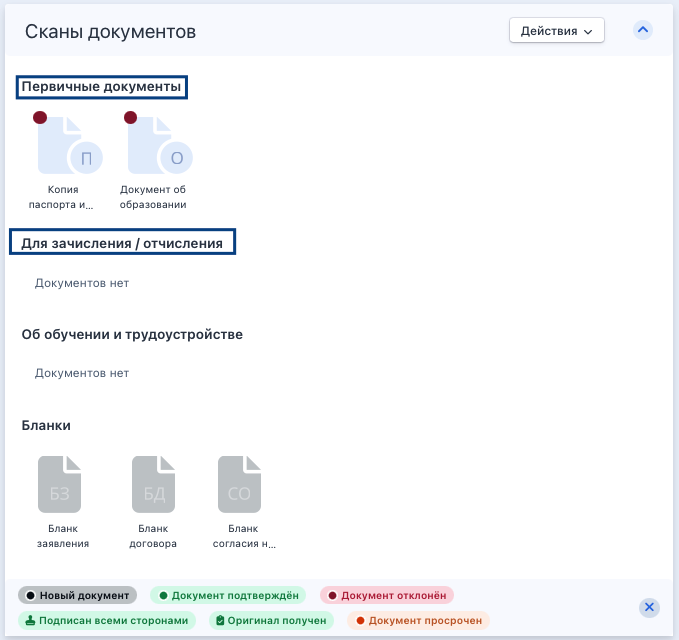
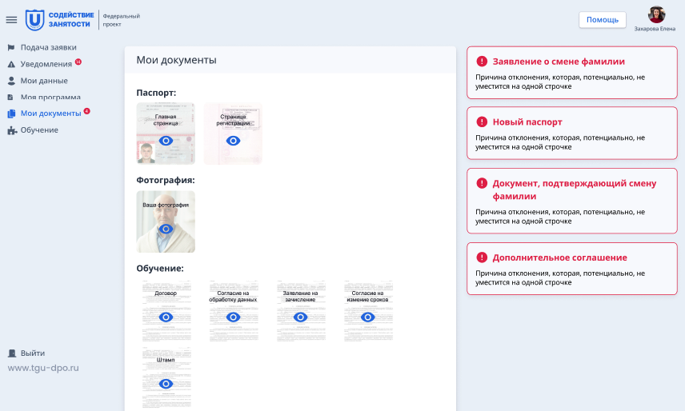
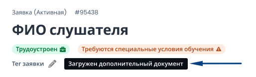
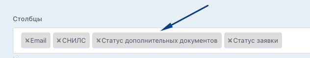

Могут возникнуть потребности в загрузке дополнительных документов, поэтому в системе есть такая возможность, она не влияет на жизненный цикл заявки.

Возможна загрузка дополнительных документов различных типов. Например:

-  заявление о смене фамилии,

-  новый паспорт,

-  документ, подтверждающий смену фамилии,

-  дополнительное соглашение.

Отображается возможность загрузки в блоке Сканы документов - Действия - Создать/заменить.

{width=1804px height=1330px}

В ЛК гражданина загрузка доступна в разделе "Мои документы" в подразделе "Дополнительные документы (по запросу образовательной организации)», который будет отображаться в ЛК только после одобрения ДЗС.

Если гражданин загрузил дополнительный документ и отправил, значит он отобразится на странице заявки в блоке «Сканы документов». Новый паспорт, заявление о смене фамилии и документ, подтверждающий смену фамилии, будут  располагаться в «Первичные документы»; дополнительное соглашение в «Для зачисления/отчисления».

{width=679px height=640px}

Загруженный гражданином дополнительный документ будет отображаться в статусе "Новый". Представитель образовательного партнера или Администратор должен его открыть/проверить и одобрить/отклонить.\
Причина отклонения будет отображаться в ЛК гражданина. При отклонении дополнительных документов, гражданину на почту уходит письмо об отклонении. Гражданин должен заменить документ и заново его отправить.

{width=856px height=514px}

При отправке гражданином дополнительного документа у заявки появится технический тег "Загружен дополнительный документ».

{width=514px height=155px}

В списке заявок есть столбец с фильтром по статусам дополнительного документа: Нет документа, Не проверен, Подтвержден, Отклонен.

{width=632px height=118px}

Все загруженные дополнительные документы гражданина будут попадать в архив с его документами, который скачивается со страницы заявки, и который скачивается в подтверждающих документах к Акту на странице потока.

### Уточняющие моменты по работе с дополнительными документами

:::info 

Все дополнительные документы **НИКАК не влияют** ни на какие статусы заявки. 

:::

Если произошла смена ФИО, гражданин обращается в образовательную организацию. У каждой образовательной организации свой способ взаимодействия с гражданином. Если образовательной организации требуется заявление о смене фамилии, она просит гражданина написать это заявление по ее форме и загрузить во Flow. Если не требуется, загружать такое заявление не обязательно. 

Если требуется образовательной организации заключить дополнительное соглашение с гражданином к договору, который заключается во Flow, образовательная организация может подготовить шаблон этого дополнительного соглашения и попросить гражданина подписать и загрузить его во Flow. Какой порядок сама организация разработает, такой порядок и будет.

Если какой-то дополнительный документ от гражданина не потребовался, его можно просто отклонить. Удалять не обязательно.