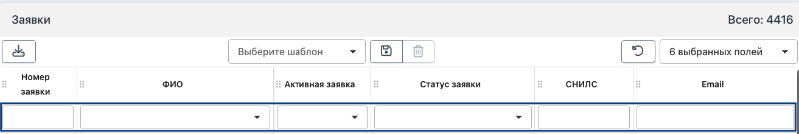
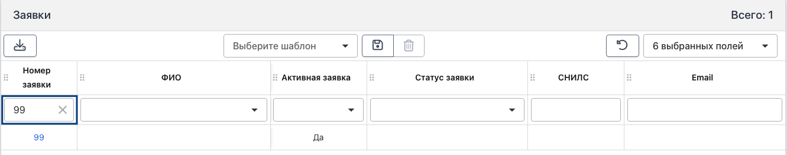
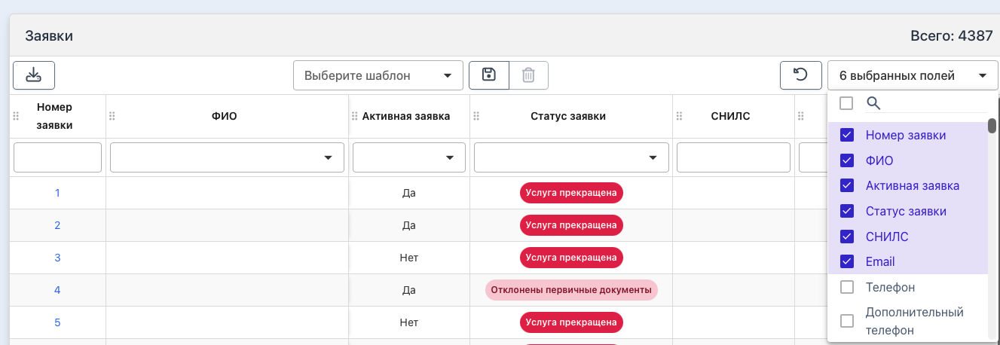
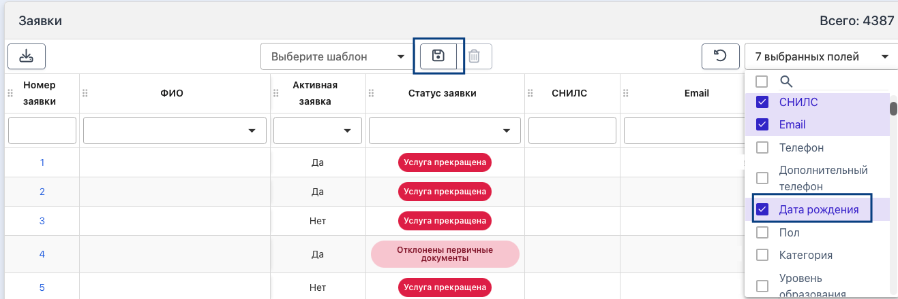
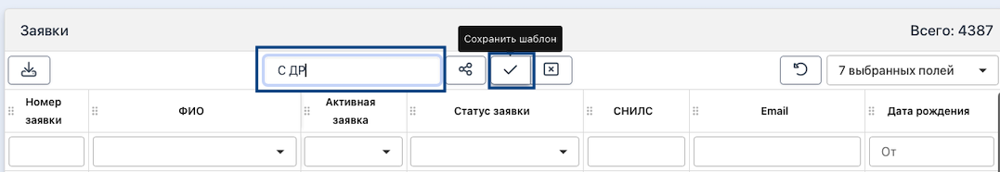
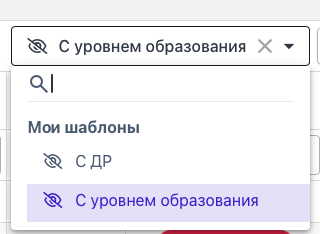
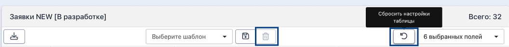
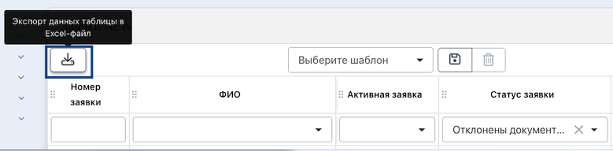

Страница заявок для быстрого и удобного доступа к любой заявке в системе. 

### Поиск

По каждому из столбцов доступен быстрый поиск. Для этого надо ввести значение и нажать Enter. 

{width=1313px height=221px}

Например, найдем заявку с номером 99:

{width=1331px height=264px}

### Шаблон

Изначально содержит на странице 6 столбцов по умолчанию: номер заявки, ФИО, указание, что заявка активная, статус заявки, СНИЛС, Email. 

{width=1327px height=458px}

Если необходимо добавить ещё какие-то столбы для отображения, то можно проставить галочку, а также сохранить набор этих столбцов как шаблон, чтобы они открывались автоматически. Сделать это можно следующим образом: например, добавили дополнительный столбец Дата рождения, далее нажимаем на кнопку «Сохранить».

{width=1317px height=440px}

Называем шаблон, сохраняем его. 

{width=1077px height=186px}

Теперь при открытии страницы заявок будет открываться по умолчанию сохраненный набор столбцов для быстрого доступа. Сохранить можно несколько таких шаблонов для разных случаев, они будут доступны вверху страницы. 

{width=320px height=234px}

Сбросить настройки таблицы или сбросить шаблон можно при помощи соответствующих кнопок. 

{width=1056px height=99px}

### Экспорт

На странице заявок доступен экспорт данных в Excel. Для этого надо настроить таблицу с данными, которые Вам надо экспортировать, например, по статусу заявок. И далее нажать на кнопку.

{width=779px height=192px}

### Уведомления

Скоро со страницы заявок можно будет отправлять уведомления. Пока функционал находится в разработке.

