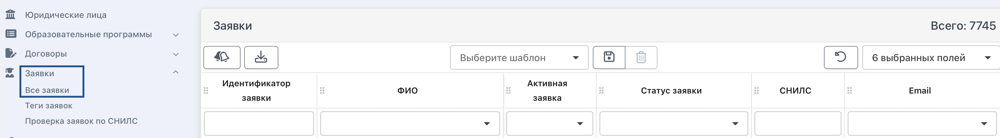
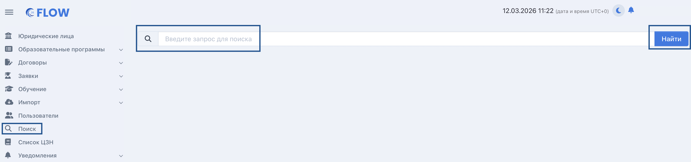
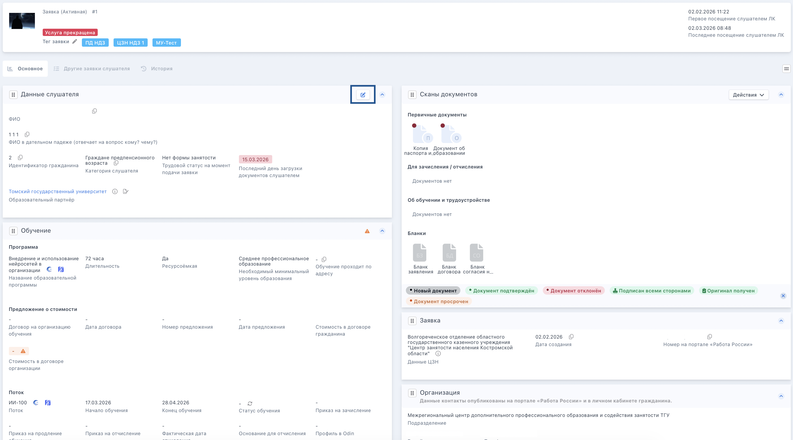

:::info 

Заявка = запись гражданина на выбранную программу. Все заявки подаются на портале [Работа России](https://trudvsem.ru/educational-programs/), заявки, поданные к ФО ТГУ, попадают во Flow. Каждой образовательной организации видны только те заявки, которые поданы на её программы. ФО видит все заявки своих ОП, ЦЗН видят заявки своего региона.

:::

Любую из заявок можно открыть из пункта меню Заявки -> Все заявки.

{width=3284px height=456px}

**Внимательно изучите** [**статусы**](./statusy-zayavok)**, каждый из которых подскажет, требуется или нет совершить какие-либо действия по заявке.**

Также найти любую заявку или элемент системы можно через глобальный поиск, который расположен в левой части страницы в меню.

{width=3332px height=786px}

### **Страница заявки**

**Во Flow   страница разделена на блоки:**

-  Данные слушателя

-  Обучение

-  Личные документы

-  Основное образование

-  Работа России

-  Сканы документов

-  Заявка

-  Организация

-  Контакты

В каждом из блоков отображается соответствующая информация о гражданине, которую можно просмотреть и некоторые данные отредактировать.

{width=2954px height=1640px}

### Активная/Неактивная заявка

:::info 

За время проекта участник может подать несколько заявок.  Последняя по дате заявка будет активной.

:::

Например, гражданин подал заявку, но не успел вовремя подписать соглашение/решил выбрать другую программу, отклонил текущую заявку или она истекла. Затем подал новую. Его самая последняя заявка считается активной в системе, все предыдущие - неактивные.