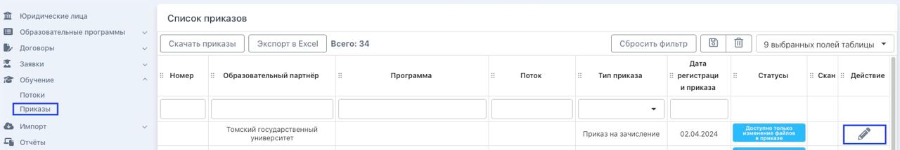
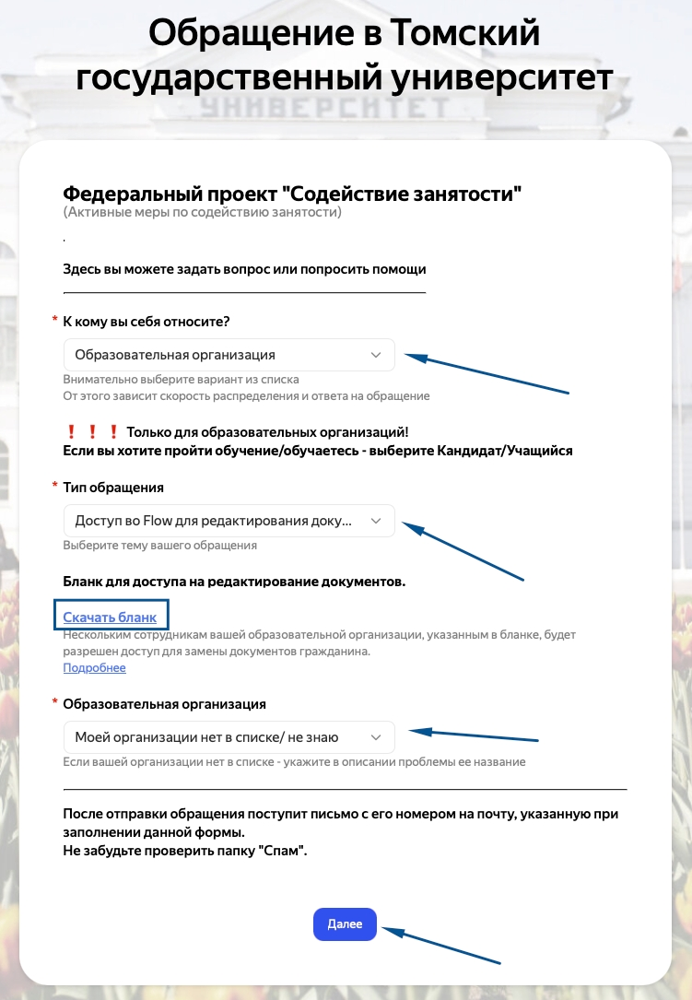

Не редки случаи, когда требуется заменить нечёткий документ. Проводите замену внимательно.

:::danger 

**Будьте максимально внимательны при замене документов.**

1. При замене одного документа удаляются все его страницы. То есть, если Вы хотите дополнить 1 страницу договора сначала **скачайте** все страницы, затем загрузите/замените **файл полностью**.

2. При замене диплома (документа об образовании) удалится сразу и документ о смене фамилии. Если меняете только диплом/документ о смене фамилии, скачайте документ о смене фамилии/диплом и загрузите оба документа сразу.

**Помочь восстановить удаленные файлы документов не сможем. Вам придётся самостоятельно по своим каналам запрашивать их у гражданина и повторно загружать во  Flow.**

:::

### Как заменять документы (первичные и ДЗС)?

На странице заявки в блоке сканы документов надо выбрать "Действия с документами", далее функцию "Создать/Заменить документы". Кнопка будет доступна пользователям, которым открыт доступ к Созданию/редактированию документов.

{width=1027px height=522px}

1. Нажмите кнопку "Создать/заменить документы"

2. Выберите документ, который необходимо заменить.

3. Выберите верный файл на компьютере.

4. Сохраните.

:::tip 

Создать возможно **только Заявление на отчисление по собственному желанию**. Другие документы создавать **запрещено**.

:::

### Что проверять прежде всего?

Все данные в договоре и других документах должны быть идентичны сгенерированным во Flow документам гражданина. Например, если вы заменяете скан договора, а на РР все данные по нему (даты обучения, номер договора, дата генерации) уже переданы, то после замены скана данные **не будут обновлены**. ([Проверка ДЗС](./../README/_index)).

### Как заменять скан приказа?

Если приказ передан на РР возможно только заменить скан приказа, другие данные менять запрещено. Заменить/добавить скан-приказа возможно в списке приказов, кликнув на карандашик.

Возможность замены скана приказа доступна представителю образовательного партнера.

{width=1280px height=215px}

:::info 

Обратите внимание, в заменяемом **файле** - скане приказа:

-  **номер приказа**,

-  **поток обучения**,

-  **образовательная программа,**

-  **тип приказа,**

-  **основание для выпуска приказа,**

-  **дата выпуска приказа**

должны полностью соответствовать тем данным, которые вы указали при создании приказа во Flow. Указанные данные переданы на РР.

:::

### Как получить доступ для замены документов?

Необходимо написать обращение <https://tgu-dpo.ru/form>, скачать и заполнить [бланк](https://docs.google.com/document/d/1lU2tVwDKBB_V_Dv718ETFPNbllp5j0CY/edit?usp=sharing&ouid=114670627208098431049&rtpof=true&sd=true), где вы укажете данные документоведов вашей образовательной организации, кто получит доступ на замену/редактирование документов граждан.

{width=751px height=1085px}

:::info 

Все замены документов логируются, то есть будет записано, какой именно пользователь произвел замену какого документа.

:::